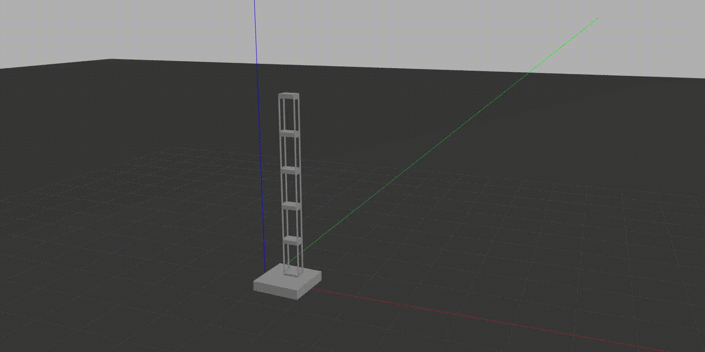

# Gazebo Sim Package

## Overview
The `gazebo_sim` package is designed for simulating a shaking table environment in Gazebo. It includes:
- A shaking table model capable of controlled oscillations.
- A custom plugin to define shaking behavior based on amplitude and frequency.
- A shear building model to simulate structural behavior during oscillations.
- A GUI to interactively control simulation parameters.

This package is ideal for structural and mechanical engineers performing modal analysis, or anyone interested in simulating dynamic systems in Gazebo.

---

## Features

- **Custom Models:**
  - **Shaking Table:** A dynamic table that oscillates based on input parameters.
  - **Shear Building:** A structural model for modal analysis.
- **Custom Plugin:**
  - Written in C++ to control the shaking behavior of the table.
  - Parameters like amplitude and frequency can be adjusted interactively.
- **Python GUI:**
  - A user-friendly interface to control simulation parameters.
- **Integration with ROS:**
  - Enables interaction with ROS topics and nodes for real-time control and data processing.

---


---
## Installation

1. Clone the repository into your ROS workspace:
   ```bash
   cd ~/tesol_ws/src
   git clone <repository-url>
   ```

2. Build the package:
   ```bash
   cd ~/tesol_ws
   catkin build
   ```

3. Source the workspace:
   ```bash
   source ~/tesol_ws/devel/setup.bash
   ```

---

## Usage

1. Launch the simulation:
   ```bash
   roslaunch gazebo_sim shaking_table_gui.launch
   ```

2. Interact with the GUI to adjust shaking parameters:
   - Amplitude
   - Frequency

3. Observe the simulation in Gazebo and analyze the behavior of the shear building on the shaking table.

---

## Directory Structure

```plaintext
gazebo_sim/                   # Root of the package
├── CMakeLists.txt            # CMake build configuration for the package
├── package.xml               # Package manifest (dependencies and metadata)
├── launch/                   # Directory for ROS launch files
│   └── shaking_table_gui.launch  # Launch file to start Gazebo with plugins and GUI
├── models/                   # Directory for custom Gazebo models
│   ├── shaking_table/        # Custom shaking table model
│   │   ├── model.sdf         # SDF file describing the shaking table model
│   │   └── model.config      # Config file for the shaking table model
│   └── shear_building/       # Custom shear building model
│       ├── model.sdf         # SDF file describing the shear building model
│       ├── model.config      # Config file for the shear building model
│       └── meshes/           # Directory for 3D meshes used by the building model
│           └── shear_building.STL  # 3D model of the shear building
├── plugins/                  # Directory for custom Gazebo plugins
│   ├── CMakeLists.txt        # CMake file for building plugins
│   ├── shaking_plugin.cpp    # Plugin code for the shaking table behavior
│   └── build/                # Build directory for the plugins
│       └── libshaking_plugin.so  # Compiled plugin shared library
├── scripts/                  # Directory for Python scripts
│   └── shaking_gui.py        # CustomTkinter-based GUI for controlling the shaking table
├── src/                      # Source directory (typically for C++ ROS nodes, optional)
├── worlds/                   # Directory for Gazebo world files
│   └── shaking_table.world   # World file for the simulation
```

---

## File Descriptions

### **CMakeLists.txt and package.xml**
- **CMakeLists.txt:** Specifies build instructions for the package.
- **package.xml:** Defines dependencies and metadata for ROS integration.

### **Launch Files**
- **shaking_table_gui.launch:** Starts Gazebo with the shaking table world, plugins, and GUI.

### **Models**
- **shaking_table:**
  - Represents the dynamic shaking table.
  - Contains collision and visual elements.
- **shear_building:**
  - Represents the structure placed on the shaking table.
  - Includes meshes for visualization.

### **Plugins**
- **shaking_plugin.cpp:**
  - Custom plugin to control table movement.
  - Uses parameters for amplitude and frequency.

### **Scripts**
- **shaking_gui.py:**
  - A Python-based GUI for controlling simulation parameters interactively.

### **Worlds**
- **shaking_table.world:**
  - Defines the simulation environment, including the shaking table and shear building.

---

## Contributing

1. Fork the repository.
2. Create a new branch:
   ```bash
   git checkout -b feature-name
   ```
3. Commit your changes:
   ```bash
   git commit -m "Add new feature"
   ```
4. Push to your branch:
   ```bash
   git push origin feature-name
   ```
5. Open a pull request.

---

## License
This package is licensed under the [MIT License](LICENSE).

---

## Acknowledgments
Special thanks to the Gazebo and ROS communities for their invaluable resources and support.
